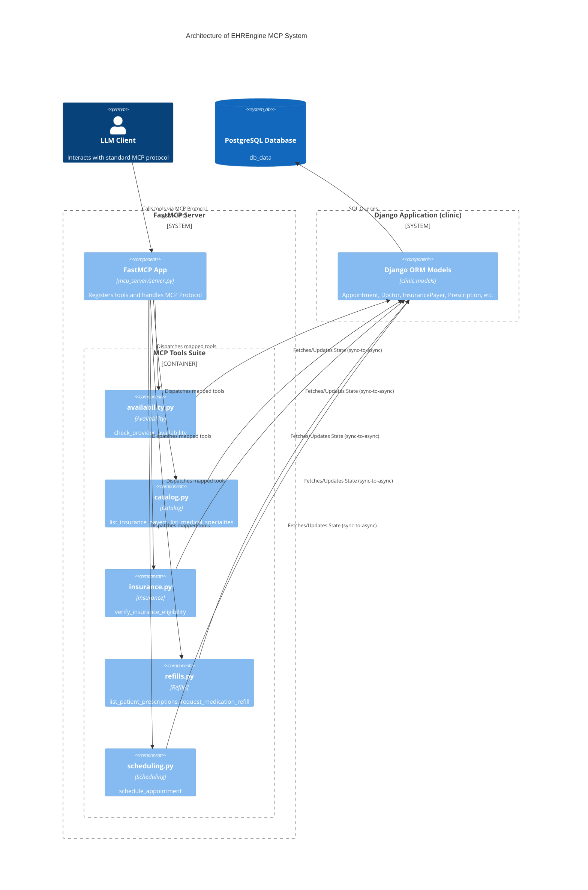

# Architecture of EHREngine MCP System

## Step-by-Step Code References

- **LLM Client**: Represents any agent resolving the instructions mapped in `mcp_server/server.py lines 20-33`.
- **FastMCP App**: Declared in `mcp_server/server.py line 19`. Bootstrapping and tool injection handlers (`_traced_async_tool`) occur in `mcp_server/server.py lines 35-50`.
- **availability.py**: Registered via FastMCP sync-wrapper on `mcp_server/server.py line 42`.
- **catalog.py**: Tool mappings initialized on `mcp_server/server.py lines 39-40`.
- **insurance.py**: Component injection tracked on `mcp_server/server.py line 41`.
- **refills.py**: Functions exposed endpoints mapping onto `mcp_server/server.py lines 44-45`.
- **scheduling.py**: System terminal execution point registered via `mcp_server/server.py line 43`.
- **Django ORM Models**: Underlying model state manipulated through querysets linked in tool implementations via local application `clinic.models`.
- **PostgreSQL Database**: Configured SQL persistence layer managed natively backing Python's execution logic.