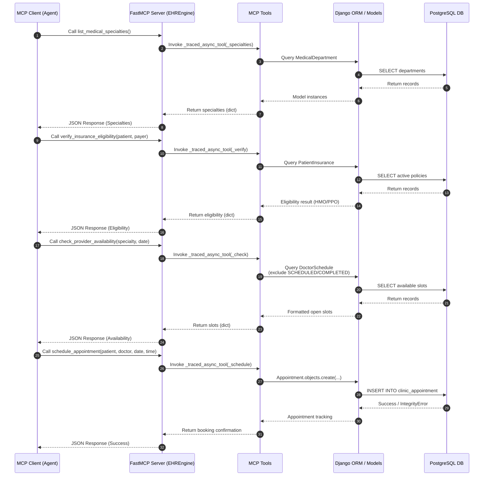

# EHREngine MCP Architecture & Workflow

## Diagram

## Step-by-Step Code References

*   **FastMCP Server (EHREngine)**
    *   File Path: `mcp_server/server.py lines 12-43`
    *   Explanation: This is the core entry point of the FastMCP application. The server initializes here, logs with `logfire` through `_traced_async_tool`, and exposes four main interactive tools bound securely.

*   **Call list_medical_specialties() / Invoke _traced_async_tool(_specialties)**
    *   File Path: `mcp_server/tools/catalog.py lines 30-59`
    *   Explanation: The MCP Client searches for available medical specialties in the system. The Django ORM queries `MedicalDepartment` and calculates active doctor counts dynamically. 

*   **Call verify_insurance_eligibility(patient, payer) / Invoke _traced_async_tool(_verify)**
    *   File Path: `mcp_server/tools/insurance.py lines 6-76`
    *   Explanation: Validates whether the given patient has active policy terms covering the appointment. The ORM queries `PatientInsurance` enforcing that coverage is active (`enrollment_start` & `enrollment_end`), and returns if it's "HMO" or "PPO" to inform the Agent about referral needs.

*   **Call check_provider_availability(specialty, date) / Invoke _traced_async_tool(_check)**
    *   File Path: `mcp_server/tools/availability.py lines 5-78`
    *   Explanation: Looks for empty slots. The system queries `DoctorSchedule` ensuring `appointment__status` excludes `SCHEDULED` and `COMPLETED`. Retrieves open schedule records for formatting.

*   **Call schedule_appointment(...) / Invoke _traced_async_tool(_schedule)**
    *   File Path: `mcp_server/tools/scheduling.py lines 4-96`
    *   Explanation: Completes the transaction. The tool fetches the exact `DoctorSchedule` slot and, protecting against race conditions via DB `IntegrityError` constraints (`clinic.models.Appointment`), inserts the record.

*   **Django ORM / Models & PostgreSQL DB Interaction**
    *   File Path: `pyproject.toml lines 8-9` and `clinic/models/` definitions
    *   Explanation: Underlying connection management using `psycopg2-binary` binding Django's standard Object-Relational Mapper seamlessly into standard PostgreSQL. Data interactions throughout flow down to this layer automatically.