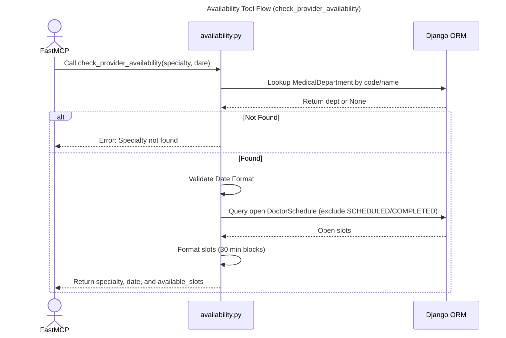

# MCP Availability Tool

## Step-by-Step Code References

- **Call check_provider_availability**: Root integration endpoint execution evaluated via mapping in `mcp_server/tools/availability.py lines 4-22`.
- **Lookup MedicalDepartment by code/name**: Search bounds against internal mappings mapped on `mcp_server/tools/availability.py lines 25-28`.
- **Error: Specialty not found**: Feedback loop resolution logic bounded inside constraints mapped explicitly at `mcp_server/tools/availability.py lines 30-40`.
- **Validate Date Format**: Parse test handling standard ISO formats via `mcp_server/tools/availability.py lines 42-49` avoiding systemic model crash states.
- **Query open DoctorSchedule (exclude SCHEDULED/COMPLETED)**: Database queries enforcing scheduling locks through exclude blocks running across `mcp_server/tools/availability.py lines 51-60`.
- **Format slots (30 min blocks)**: Structure logic iterating values into standardized JSON models passed through `mcp_server/tools/availability.py lines 62-71`.
- **Return specialty, date, and available_slots**: Endpoint wrap dict response bounded via return output logic in `mcp_server/tools/availability.py lines 73-78`.