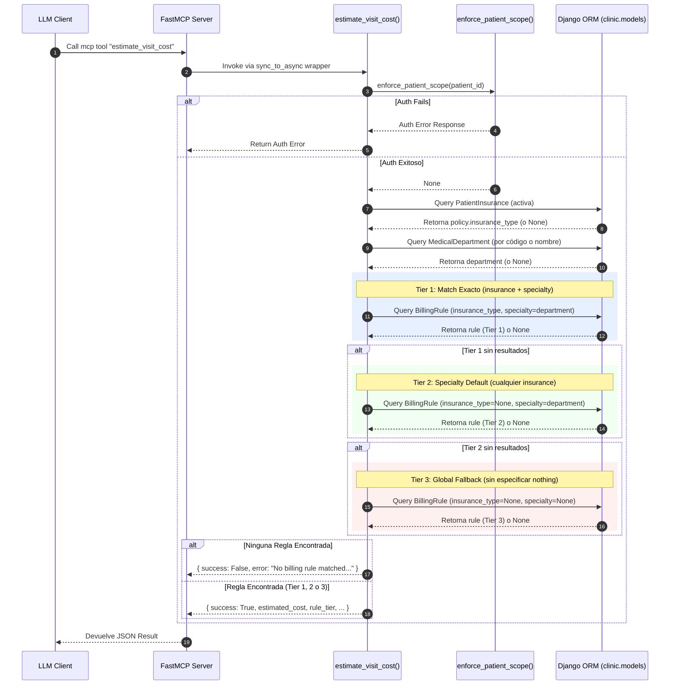

# Documentación de Facturación (Billing MCP Tool)

## Referencias de Código Paso a Paso

- **LLM Client**: El cliente o agente que envía la solicitud al servidor FastMCP para calcular los costos en base a un seguro. No mapeado en el código, origen externo.
- **FastMCP Server**: Componente principal expuesto en `mcp_server/server.py lines 14-48`. Registra y enruta las ejecuciones del cliente.
- **Call mcp tool "estimate_visit_cost"**: El llamado inicial del cliente hacia FastMCP.
- **Invoke via sync_to_async wrapper**: Ocurre en `mcp_server/server.py line 48` e instrumentado en `mcp_server/server.py lines 30-41` usando `_traced_async_tool`.
- **estimate_visit_cost()**: La función principal definida en `mcp_server/tools/billing.py lines 9-90`. Ejecuta toda la lógica en cascada.
- **enforce_patient_scope()**: Chequeo de acceso de seguridad invocado en `mcp_server/tools/billing.py lines 34-36` e importado de `mcp_server.auth`.
- **Auth Error Response**: Retorno del error en `mcp_server/tools/billing.py line 36` si el usuario no tiene acceso a ese `patient_id`.
- **Query PatientInsurance (activa)**: Consulta ORM en `mcp_server/tools/billing.py lines 42-50` para obtener la póliza activa actual y extraer `insurance_type`.
- **Query MedicalDepartment (por código o nombre)**: Consulta ORM en `mcp_server/tools/billing.py lines 54-62` para resolver la especialidad consultada.
- **Tier 1: Match Exacto (insurance + specialty)**: Intento de coincidencia estricta evaluado en `mcp_server/tools/billing.py lines 68-73`.
- **Tier 2: Specialty Default (cualquier insurance)**: Intento de uso de costo genérico para la especialidad evaluado en `mcp_server/tools/billing.py lines 75-80`.
- **Tier 3: Global Fallback (sin especificar nothing)**: Intento de costo mínimo general evaluado en `mcp_server/tools/billing.py lines 82-87`.
- **Ninguna Regla Encontrada**: Resolución fallida devolviendo error descriptivo en `mcp_server/tools/billing.py lines 89-95`.
- **Regla Encontrada (Tier 1, 2 o 3)**: Se ensambla dict de éxito y costo numérico en `mcp_server/tools/billing.py lines 103-112`.
- **Devuelve JSON Result**: Retorno final a través de FastMCP al cliente LLM.