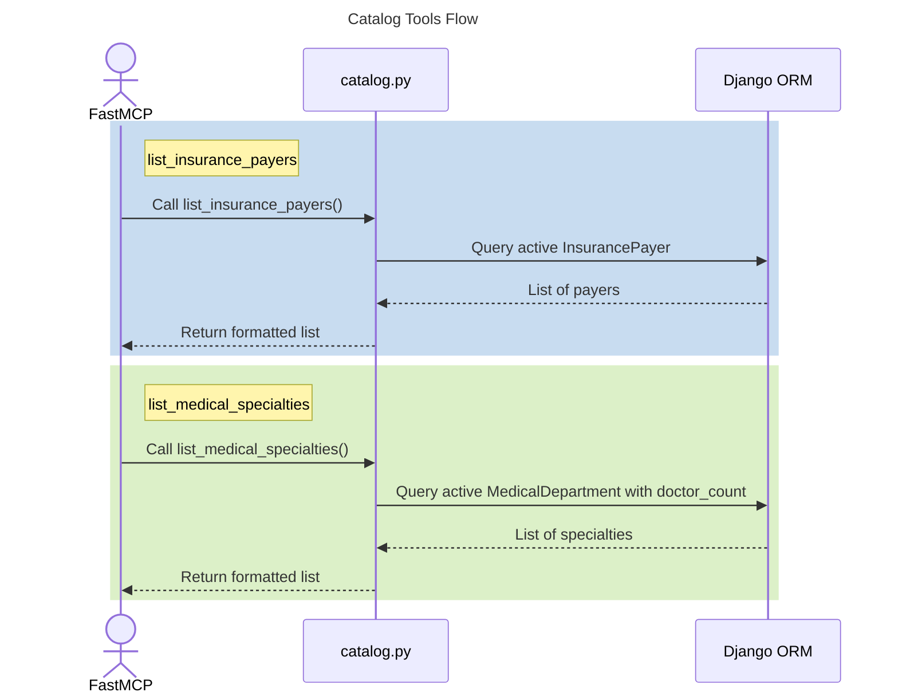

# MCP Catalog Tools

## Step-by-Step Code References

- **Call list_insurance_payers()**: Function entry execution triggers inside `mcp_server/tools/catalog.py lines 4-10` describing discovery operation parameters.
- **Query active InsurancePayer**: Retrieval queryset executed via `mcp_server/tools/catalog.py lines 14-16` requesting elements sorted by name filtered where active.
- **Return formatted list (payers)**: Loop composing returned output dictionary in `mcp_server/tools/catalog.py lines 18-28`.
- **Call list_medical_specialties()**: Flow traverses into second capability initialized via `mcp_server/tools/catalog.py lines 33-41`.
- **Query active MedicalDepartment with doctor_count**: DB mapping happens within the query engine across `mcp_server/tools/catalog.py lines 45-51` joining models using active modifiers.
- **Return formatted list (specialties)**: Data dictionary output returned explicitly resolving across `mcp_server/tools/catalog.py lines 53-61`.