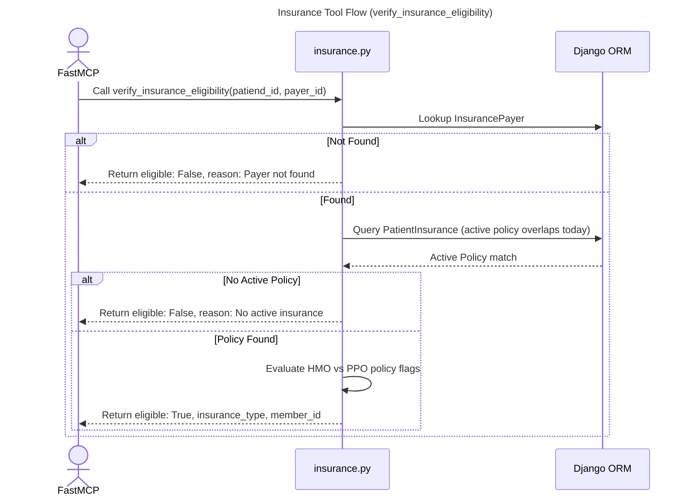

# MCP Insurance Tool

## Step-by-Step Code References

- **Call verify_insurance_eligibility**: Request sinks to target logical endpoint executing variables spanning `mcp_server/tools/insurance.py lines 6-25`.
- **Lookup InsurancePayer**: ID checking parsing logic mapped inside `mcp_server/tools/insurance.py lines 27-33` checking IDs vs. Name codes string mappings.
- **Return eligible: False, reason: Payer not found**: Execution fallout failure handled natively passing `mcp_server/tools/insurance.py lines 34-42` emitting feedback to the LLM agent.
- **Query PatientInsurance (active policy overlaps today)**: Submitting the filtered parameter constraints back down to `mcp_server/tools/insurance.py lines 44-54` bounding logic around standard valid intervals (null limits or future projections).
- **Return eligible: False, reason: No active insurance**: Early abort triggers checking empty policy values on `mcp_server/tools/insurance.py lines 56-59`.
- **Evaluate HMO vs PPO policy flags / Return dictionary**: Success branch execution handles resolving descriptions formatted mapped through keys matching dictionary fields in `mcp_server/tools/insurance.py lines 61-77`.