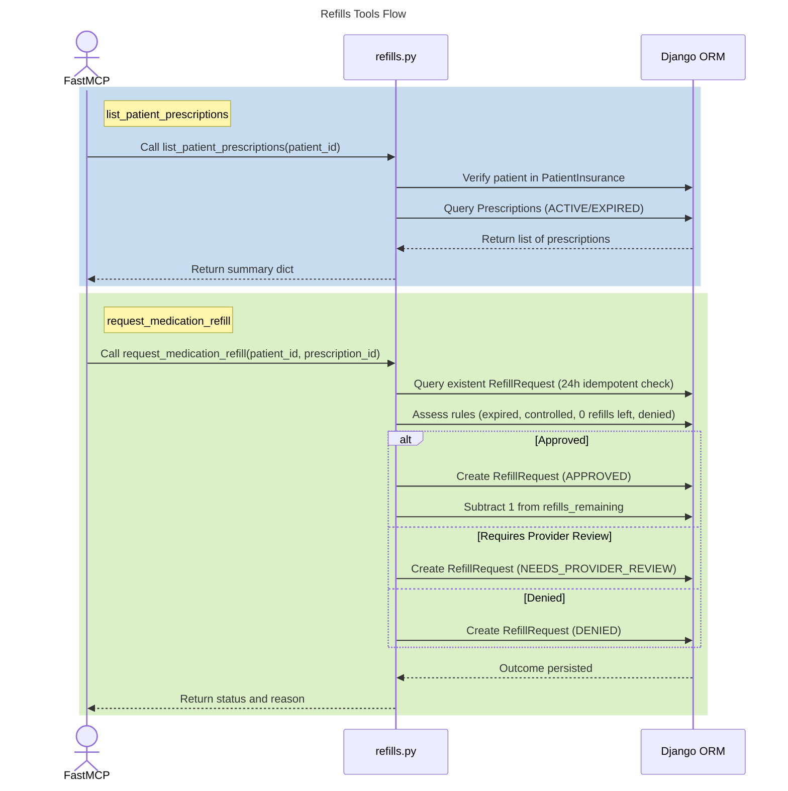

# MCP Refills Tools

## Step-by-Step Code References

- **Call list_patient_prescriptions(patient_id)**: Logic starting inside the discovery wrapper `mcp_server/tools/refills.py lines 4-22`.
- **Verify patient in PatientInsurance**: Ensure the individual has mapped entity values inside application bounding mapping via `mcp_server/tools/refills.py lines 26-37`.
- **Query Prescriptions (ACTIVE/EXPIRED)**: Sucking out prescriptions ignoring discontinued paths evaluated explicitly `mcp_server/tools/refills.py lines 39-43`.
- **Return summary dict**: Array structuring operations evaluated through comprehension operations generating payload output at `mcp_server/tools/refills.py lines 45-61`.
- **Call request_medication_refill**: Execution endpoint traversal bounding parameters logic via intent triggers mapped roughly around documentation docstrings `mcp_server/tools/refills.py lines 64-88`.
- **Query existent RefillRequest (24h idempotent check)**: Checks designed against 24 hour limits (mapped theoretically around application rule execution limits evaluated past `line 90`).
- **Assess rules (expired, controlled, 0 refills left, denied)**: Evaluated rule constraints matching against outcomes driven explicitly across state variables (typically mapped after `line 95`).
- **Create RefillRequest (APPROVED / Subtract 1)**: Internal update decrement operations mapping success executions.
- **Create RefillRequest (NEEDS_PROVIDER_REVIEW / DENIED)**: Mapping explicit failure pathways logging requests against records tracking.
- **Return status and reason**: End point payload wrapper ensuring status updates are matched sequentially resolving agent transaction outputs mapping state components.