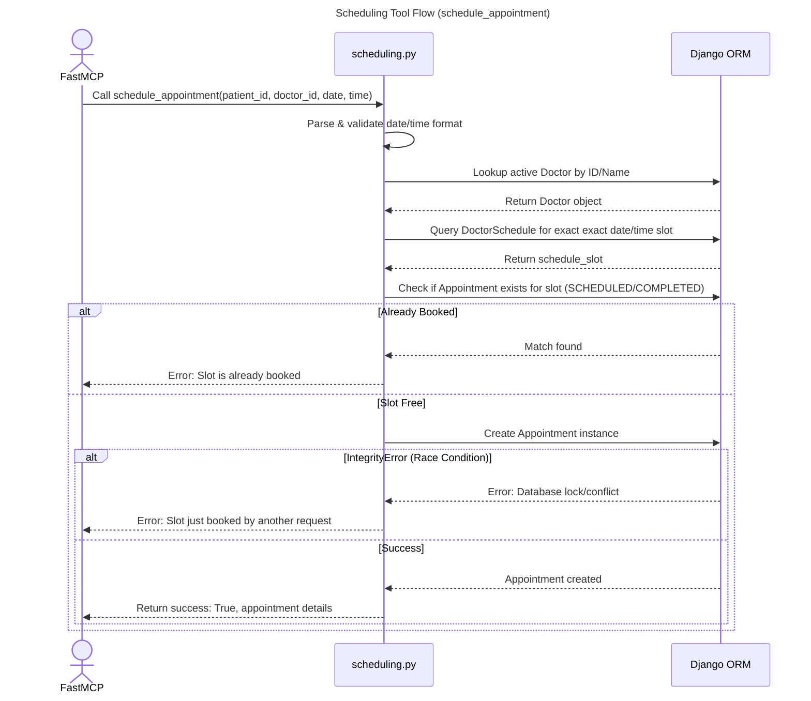

# MCP Scheduling Tool

## Step-by-Step Code References

- **Call schedule_appointment**: The external prompt drives variables passed directly onto `mcp_server/tools/scheduling.py lines 4-25` representing intent mapping for transaction completion.
- **Parse & validate date/time format**: Exception handling bounds wrapping conversion of strings to python native datetime objects via `mcp_server/tools/scheduling.py lines 29-37`.
- **Lookup active Doctor by ID/Name**: Flexible check checking strings as IDs then names returning explicitly across `mcp_server/tools/scheduling.py lines 39-48`.
- **Query DoctorSchedule for exact exact date/time slot**: Bounds logic ensuring doctor has shift availability during precise timestamps via `mcp_server/tools/scheduling.py lines 50-61`.
- **Check if Appointment exists for slot (Already Booked)**: Business duplication logic avoiding overlaps queried against internal systems mapped inside `mcp_server/tools/scheduling.py lines 63-69`.
- **Create Appointment instance / IntegrityError (Race Condition)**: Transaction atomic layer operations checking `IntegrityError` to resolve threading/async overlap races occurring in `mcp_server/tools/scheduling.py lines 71-82`.
- **Return success: True, appointment details**: Formatting outputs parsing data components bounding logic responses mapped into UI interfaces via `mcp_server/tools/scheduling.py lines 84-98`.